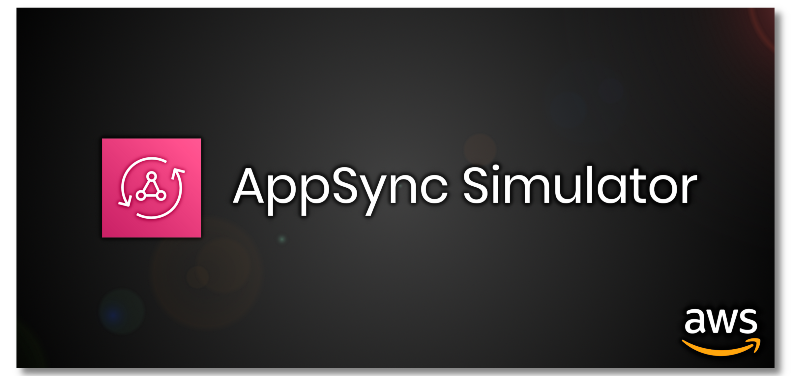

# AppSync Simulator starter kit

This repository is a starter kit which shows how to simulate AppSync locally when you are not using Amplify CLI or Serverless framework.

## Description
This example shows how to setup the simulator with Lambda data sources. Of course, you can use it with DynamoDB and OpenSearch datasources.
I'm as well using only "unit" resolvers but you can use "pipeline" resolvers.