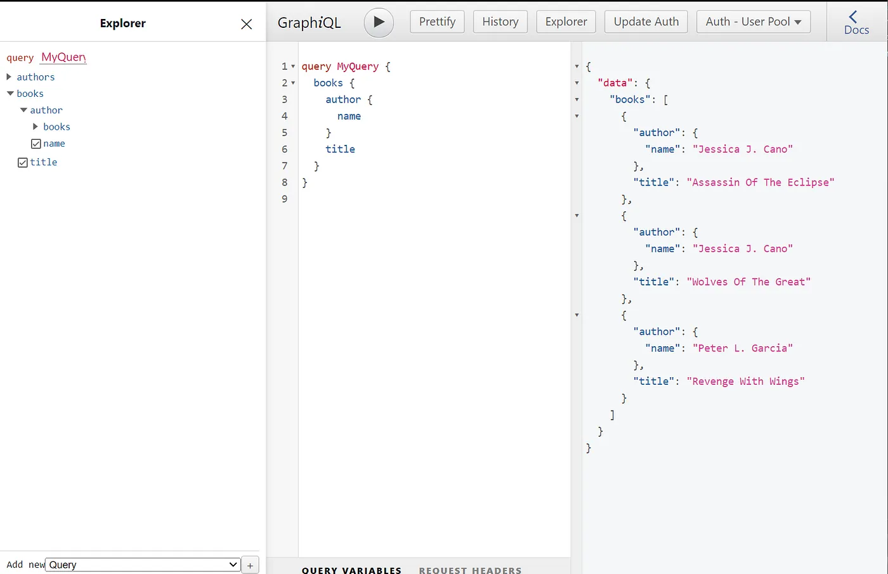

# Boost local development with AWS AppSync Simulator🚀✨

Hi there! 👊

In this article I will explain you how to simulate AWS AppSync in local when you are not fully using Amplify or Serverless framework.

## In which case you shouldn’t read this article?

If you are fully using **Amplify CLI**, you should be able to use **amplify mock** command to simulate AppSync so… you can stop reading here ^^

If you are using **Serverless** ⚡ framework, you should be able to use the **serverless-appsync-simulator** plugin to cover your need.

In any other cases, you are at the right place :)

## If you are still reading, let’s go!

What we will do through this article is building an **Amplify AppSync simulator** without using Amplify CLI at all. In fact, we will only pick the simulator which is interesting for us and use it.

We will configure the simulator with a simple GraphQL Schema (Books and authors data model) and Lambda data sources in charge of retrieving data.

Here is the model, dataset and GraphQL schema we will use:

<!-- CODE:START file=../src/types/author.ts -->
``` TypeScript
export type Author = {
    id: number,
    name: string
}

```
<!-- CODE:END -->

<!-- CODE:START file=../src/types/book.ts -->
``` TypeScript
export type Book = {
    id: number
    title: string
    authorId: number
}

```
<!-- CODE:END -->

<!-- CODE:START file=../src/data/authors.ts -->
``` TypeScript
import { Author } from "../types/author";

export const authors: Author[] = [{
    id: 1,
    name: "Jessica J. Cano"
},
{
    id: 2,
    name: "Peter L. Garcia"
}]
```
<!-- CODE:END -->

<!-- CODE:START file=../src/data/books.ts -->
``` TypeScript
import { Book } from "../types/book";

export const books: Book[] = [
    {
        id: 1,
        title: "Assassin Of The Eclipse",
        authorId: 1
    },
    {
        id: 2,
        title: "Wolves Of The Great",
        authorId: 1
    },
    {
        id: 3,
        title: "Revenge With Wings",
        authorId: 2
    }
]
```
<!-- CODE:END -->

<!-- CODE:START file=../src/schema.gql -->
``` GraphQL
type Book {
  title: String
  author: Author
}

type Author {
  name: String
  books: [Book]
}

type Query {
  books: [Book]
  authors: [Author]
}

type Mutation {
  addBook(title: String, author: String): Book
}
```
<!-- CODE:END -->

### Pre-requisites

You have **node** and **npm** installed.
You have a simple **typescript** project ready! (package.json with typescript and @types/node dependencies, tsconfig.json properly configured…)

### Add dependencies

First we will add some **development dependencies** in our project

```sh
npm install --save-dev ts-node ts-node-dev @types/aws-lambda
```

**ts-node-dev**: It will help us to start the simulator and have hot reload capabilities

**@types/lambda**: Add some Typescript types related to AWS Lambda that I will use in this example

And, finally, we will add the famous **Amplify AppSync simulator** package

```sh
npm install amplify-appsync-simulator
```

### Create lambda handlers for resolvers

We will build handlers for our query operations and to resolve nested fields.

<!-- CODE:START file=../src/resolvers/queryAuthors.ts -->
``` TypeScript
import { authors } from "../data/authors";

export const handler = () => authors;

```
<!-- CODE:END -->

<!-- CODE:START file=../src/resolvers/queryBooks.ts -->
``` TypeScript
import { books } from "../data/books";

export const handler = () => books;

```
<!-- CODE:END -->

<!-- CODE:START file=../src/resolvers/authorBooks.ts -->
``` TypeScript
import { AppSyncResolverEvent } from "aws-lambda";
import { books } from "../data/books";
import { Author } from "../types/author";

export const handler = (event: AppSyncResolverEvent<object, Author>) => {
    const author = event.source
    return books.filter((book) => book.authorId === author.id)
} 
```
<!-- CODE:END -->

<!-- CODE:START file=../src/resolvers/bookAuthor.ts -->
``` TypeScript
import { AppSyncResolverEvent } from "aws-lambda";
import { authors } from "../data/authors";
import { Book } from "../types/book";

export const handler = (event: AppSyncResolverEvent<object, Book>) => {
    const book = event.source

    return authors.find((author) => author.id === book.authorId)
} 
```
<!-- CODE:END -->

### Create request/response mapping templates

Now we will create VTL files for our request and response mapping templates. These VTL files will have to be passed to the simulator as string so I created a function to read them from the filesystem.

<!-- CODE:START file=../src/vtl/lambdaRequestMappingTemplate.vtl -->
``` Velocity Template Language
{
    "version": "2018-05-29",
    "operation": "Invoke",
    "payload": $util.toJson($context)
}
```
<!-- CODE:END -->

<!-- CODE:START file=../src/vtl/lambdaResponseMappingTemplate.vtl -->
``` Velocity Template Language
#if($ctx.error)
     $util.error($ctx.error.message, $ctx.error.type, $ctx.result)
 #end
 $util.toJson($ctx.result)
```
<!-- CODE:END -->

### Build the AppSync Simulator 🚀

Here is the interesting part! We will create the AppSync Simulator with all the configuration we have prepared before.

💡Tips: One interesting aspect is that, if you are using AWS CDK, you can share some pieces between the way you configure the simulator and the way your build your constructs.

<!-- CODE:START file=../src/main.ts -->
``` TypeScript
import {
    AmplifyAppSyncSimulator,
    AmplifyAppSyncSimulatorAuthenticationType,
    AmplifyAppSyncSimulatorConfig,
} from 'amplify-appsync-simulator'

import { handler as queryBooksHandler } from './resolvers/queryBooks'
import { handler as queryAuthorsHandler } from './resolvers/queryAuthors'
import { handler as bookAuthorHandler } from './resolvers/bookAuthor'
import { handler as authorBooksHandler } from './resolvers/authorBooks'
import { schema } from "./schema"
import { readVTL } from './vtl/readVTL'
import { resolversConfig } from './resolversConfig'


class AppSyncSimulator {
    httpPort: number
    wssPort: number

    constructor(httpPort: number, wssPort: number) {
        this.httpPort = httpPort
        this.wssPort = wssPort
    }

    async start() {
        const simulatorConfig: AmplifyAppSyncSimulatorConfig = {
            appSync: {
                defaultAuthenticationType: {
                    authenticationType: AmplifyAppSyncSimulatorAuthenticationType.AMAZON_COGNITO_USER_POOLS,
                    cognitoUserPoolConfig: {},
                },
                name: 'api-local',
                additionalAuthenticationProviders: [],
            },
            schema: { content: schema },
            mappingTemplates: [
                {
                    path: 'lambdaRequestMappingTemplate.vtl',
                    content: readVTL("lambdaRequestMappingTemplate.vtl"),
                },
                {
                    path: 'lambdaResponseMappingTemplate.vtl',
                    content: readVTL("lambdaResponseMappingTemplate.vtl"),
                }
            ],
            dataSources: [
                {
                    type: 'AWS_LAMBDA',
                    name: 'QueryBooksDataSource',
                    invoke: queryBooksHandler,
                },
                {
                    type: 'AWS_LAMBDA',
                    name: 'QueryAuthorsDataSource',
                    invoke: queryAuthorsHandler,
                },
                {
                    type: 'AWS_LAMBDA',
                    name: 'BookAuthorDataSource',
                    invoke: bookAuthorHandler,
                }, {
                    type: 'AWS_LAMBDA',
                    name: 'AuthorBooksDataSource',
                    invoke: authorBooksHandler,
                }
            ],
            resolvers: resolversConfig,
        }
        const amplifySimulator = new AmplifyAppSyncSimulator({
            port: this.httpPort,
            wsPort: this.wssPort,
        })
        await amplifySimulator.start()
        await amplifySimulator.init(simulatorConfig)
    }
}

const httpPort = 4000
const wsPort = 4001
const simulator = new AppSyncSimulator(httpPort, wsPort)
simulator.start().then(() => {
    console.log(`🚀 App Sync Simulator started at http://localhost:${httpPort}/graphql`)
})
```
<!-- CODE:END -->

And we can finally run our simulator ✨

```sh
➜ npx ts-node-dev src/main.ts

[INFO] 13:46:46 ts-node-dev ver. 2.0.0 (using ts-node ver. 10.9.1, typescript ver. 4.9.4)
🚀 App Sync Simulator started at http://localhost:4000/graphql
```

### Testing our GraphQL API

By accessing [http://localhost:4000](http://localhost:4000,)/, you can access directly the built-in Amplify GraphiQL Explorer



## AppSync Simulator Starter Kit

As usual in my articles, the related repository 😉
[**GitHub - DevWaveX/appsync-simulator-starter-kit: Starter kit for using AppSync simulator**](https://github.com/DevWaveX/appsync-simulator-starter-kit)

I hope you enjoyed reading from me! See you soon 🤘
